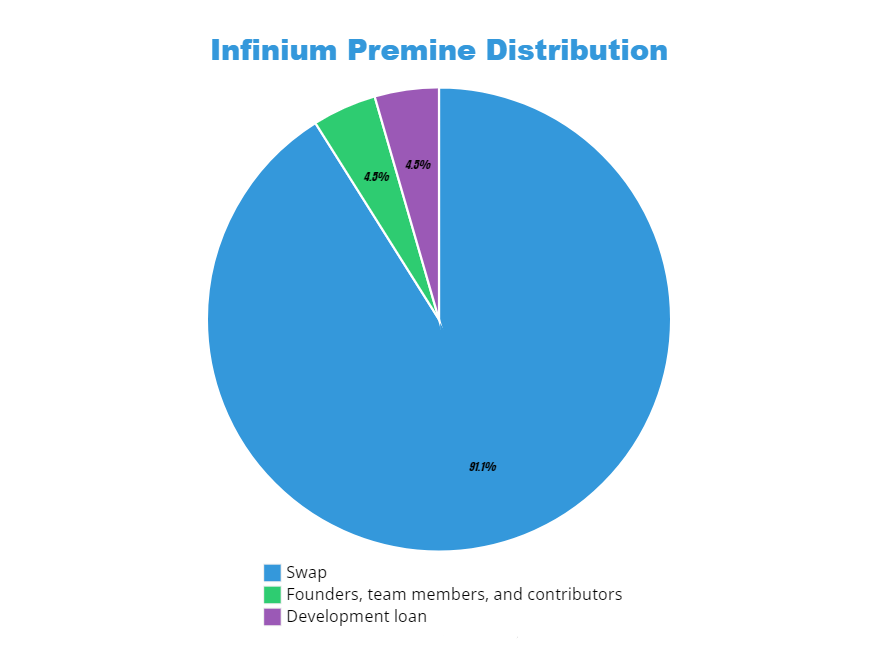

# Emission

### Where does the emission come from?

Infinium has a hybrid PoW/PoS consensus algorithm to secure the network and therefore emission is generated from two distinct sources:

Proof of Work (PoW) mining. PoW mining creates new Infinium coins to reward miners for completing the calculation and therefore contributing to the network. 100% of the block reward goes to miners.

Proof of Stake (PoS) staking. PoS staking also creates new Infinium coins to reward stakers for staking their funds and therefore contributing to the network.. 100% of the block reward goes to stakers.

### Emission specifications

| Emission              |              |
| --------------------- | ------------ |
| Block Time            | 1 minute     |
| Block Reward          | 1 INF        |
| Maximum Supply        | ∞ (uncapped) |
| Fee on TXs (flat fee) | 0.01 INF     |

### Emission motivation

Infinium made the decision to set the block reward relatively low to avoid unnecessary selling price pressure while keeping the chain safe from TX flood. The block reward is fixed at 1 Infinium per block. We have an uncapped max supply because the assumption that TX flow and its fees would be enough to cover miners' appetite might not be accurate and Bitcoin might become a sad example of this. Having a fixed and slow emission (backed by strong consensus algo) looks like a more safe choice to us.

Infinium total supply increases slightly over time while the inflation percentage decreases sligthly over time which can be seen below.

| Date       | Total Supply (INFINIUM) | Increasement of total supply compared to the year before |
| ---------- | ----------------------- | -------------------------------------------------------- |
| 01-01-2024 | 70,000,000              | ~0,751%                                                  |
| 01-01-2025 | 70,525,600              | ~0,745%                                                  |
| 01-01-2026 | 71,051,200              | ~0,740%                                                  |
| 01-01-2027 | 71,576,800              | ~0,734%                                                  |
| 01-01-2028 | 72,102,400              | ~0,729%                                                  |
| 01-01-2029 | 72,628,000              | ~0,724%                                                  |
| 01-01-2030 | 73,153,600              | ~0,718%                                                  |
| 01-01-2031 | 73,679,200              | ~0,713%                                                  |
| 01-01-2032 | 74,204,800              | ~0,708%                                                  |
| 01-01-2033 | 74,730,400              | ~0,703%                                                  |
| 01-01-2034 | 75,256,000              | ~0,698%

### Why was there a swap with Infinium-8?

The Infinium project is a technological evolution of the Infinium-8 (INF8) project, a previous project of the Infinium Developers. However, at the same time, the project has different emission curve and premine. To not screw over holders of Infinium-8 (INF8) we decided that it would be fair to give INF8 holders a choice: they were able to join in on the new model by participating in the swap and exchanging their INF8 to INF.

The swap resulted in 63M swapped coins.

### Why is the block reward just 1 Infinium?

Infinium has a unique consensus system in which in order to perform the classic 51% attack, you need to have at least 51% PoW hashrate AND 51% PoS power (there can also be other ratios like 20%/90% and so on whitepaper. This way an attack becomes very expensive, in particular because the purchase of a significant portion of the coins on the market, would dramatically increase the price. If you try to use a small percentage of PoS coins for the attack, then the PoW power necessary for the attack becomes 800% or more. This makes it possible to establish a relatively low block reward and at the same time provide a high security level for the transaction history.

### Premine

Being actively involved into crypto space since 2014, the Infinium team has been studying every financial model in the crypto market. Some of them are more sustainable than others but in the end they all come down to burning through reserves if the project doesn’t get picked up before reaching the “mainstream” phase.

Even top tier projects have come across this issue in the past. These financial struggles have either required another round of personal investment, a second ICO, a call for donations, or simply resulted in the end of those projects.

Infinium proposes a new solution. By staking our own development fund we will be able to run our operations using the interest gained, giving the team an ongoing source of funding to keep everyone paid and working happily. This also means that the actual development fund will remain intact.

**91% Swap (63,740,000 INF)** Reserved for swap. This will be transparent and reported.

**4.5% Founders, team members, and contributors (3,130,000 INF)**
Coins are reserved for incentivizing current and future team members and contributors.

**4.5% Development loan (3,130,000 INF)**
Repayment of the coins loaned by a group of Infinium-8 shareholders in early 2024 to fund the project development leading up to the swap.

**Conclusion**

Most important to us is the long-term security and stability of Infinium. This ability to generate income to fund the project continuously is a new and exciting possibility. We’ve spent a great deal of time pouring over the numbers and believe this path forward not only assures success for the team, but also for all holders of Infinium coins for years to com