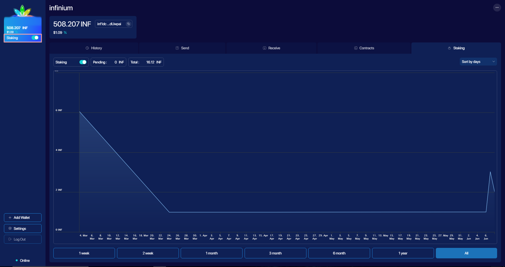

# Proof of Stake Mining
Proof of stake mining or staking is typically implemented in such way that a random coin owner obtains the right to sign a new block. Infinium PoS implementation keeps miners in full anonymity and is as simple as a push of a button, literally.

Open Infinium app, make sure the blockchain is synchronised and turn on `Staking` switch.

 <figcaption style={{textAlign: "center" }} >Proof-of-stake mining</figcaption>

You can observe your progress in the `Staking` tab of your staking wallet. The amount of earnings depends on the wallet balance. Note that funds, that participate in proof-of-stake will be locked. When you turn `Staking` off, balance will get unlocked right away. You can switch `Staking` on and off without any limitations.