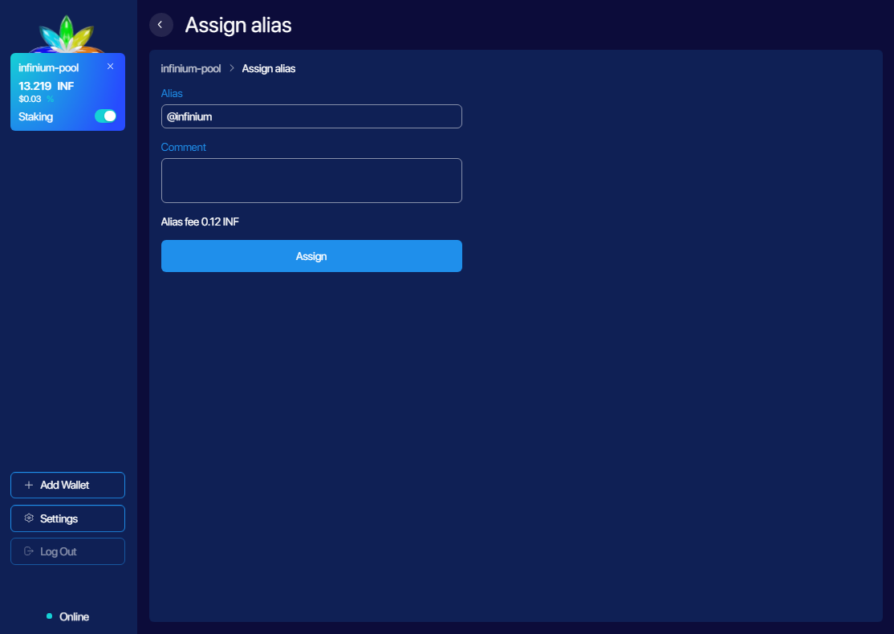

# Aliases

Each Infinium user can register with an alias, for example: @easytouse, a human-readable name associated with a payment address and text comment, which is stored in the blockchain. This alias provides a short, easy-to-remember name rather than a long and confusing string of random characters. Blockchain storage ensures that aliases are protected from being altered or commandeered.

Each alias is assigned to a particular wallet. Only one alias can be created per wallet. To register an alias choose Register an alias from wallet main window.

To reduce possibility of phishing we set limitations on alias registrations. Users can use any combination of the lower-case Latin letters a-z and the Arabic numerals 0-9. Additionally, there is a length minimum of 6 characters, and a maximum length of 12.

The comment section will be temporarily stored in the blockchain until passing a checkpoint. For more information on pruning mechanism please refer to the whitepaper.

_<figcaption style={{textAlign: "center" }} >Alias registration</figcaption>_

Aliases can be used for more than just Infinium transactions. Think of them as a decentralised address book with universal IDs that can be used for various services based on the Infinium platform.