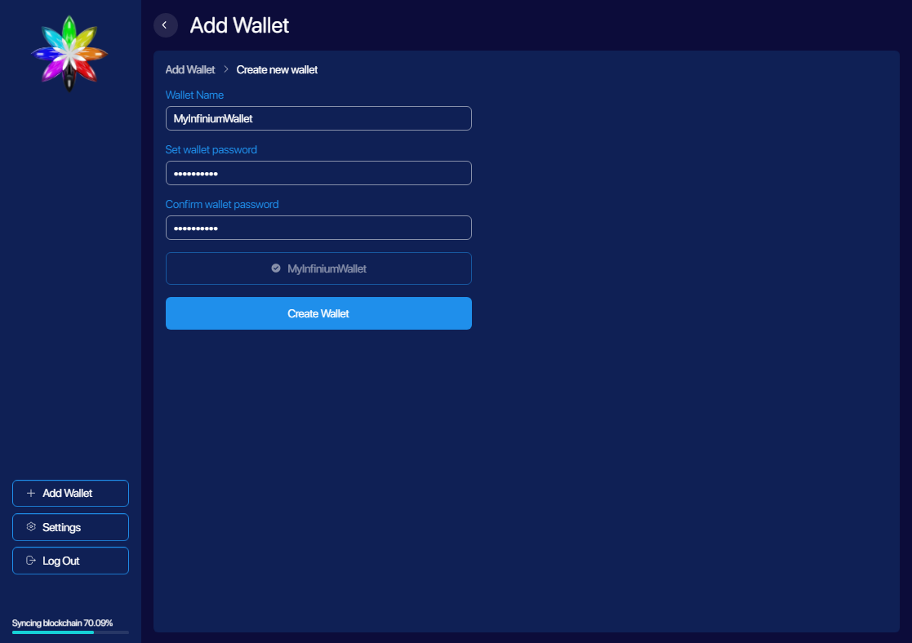
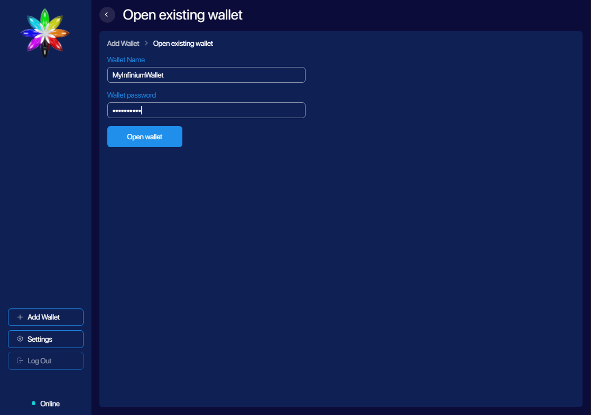
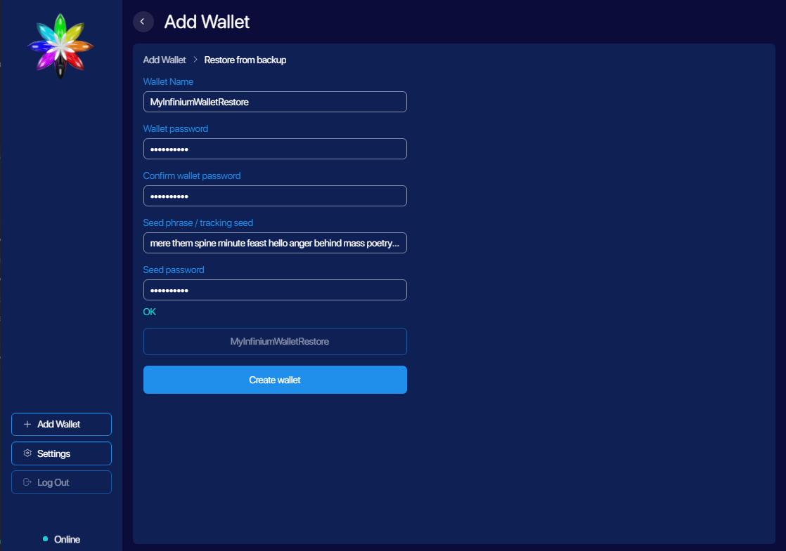

# Managing Wallets

Infinium app lets you manage multiple Infinium wallets, which can be easily created, restored and removed from the app. The core of each wallet is a seed phrase. It's a sequence of 24 words, that can be used to recovery your wallet private and public keys. Every time you create a new wallet within the app, a unique sequence is generated. It's important to always keep it safe and accessible.

For your convenience it's not necessary to use a seed phrase to manage your wallet. When you create a wallet the wallet file is generated as well. The file is secured with additional password and grants access to wallet features and the seed phrase. It can be copied to another device and used with another app.

### Creating wallets

There are 3 ways to create a wallet in Infinium app. From the `Wallets` `Add` section choose

- Create new wallet

1. Enter wallet name and password
2. Click `Select wallet location` to choose wallet file location and name
3. Continue with `Create wallet`
4. Save shown seed phrase in a secure place and click `Create`

_<figcaption style={{textAlign: "center" }} >Create new wallet</figcaption>_

- Open existing wallet

1. Locate wallet file
2. Enter password then open wallet

_<figcaption style={{textAlign: "center" }} >Open existing wallet</figcaption>_

- Restore from backup

1. Enter new wallet info
2. Recover and enter previously stored seed phrase
3. Click `Select wallet location` to choose wallet file location and name
4. Continue with `Create wallet`

_<figcaption style={{textAlign: "center" }} >Restore from backup</figcaption>_

### Wallet details

Each Infinium wallet can be identified by a custom name assigned on creation. This name can be edited in `Details` section anytime. Information about wallet file location and it's seed phrase available here as well. Note that you can copy the seed phrase by clicking right mouse button over it and choosing `COPY` from the context menu.

You can remove a wallet from the Infinium app by clicking `Close wallet` in the same section. Note that wallet file will remain unaffected and you can import it again anytime if necessary.

_<figcaption style={{textAlign: "center" }} >Wallet details</figcaption>_

### Changing wallet password

In case you want to change wallet file password, you need to use `Restore from backup``. The following step will be required.

1. Make sure you have the seed phrase saved
2. Click `Close wallet` from wallet `Details`
3. Delete wallet file
4. Click `+Add` from `Wallets` menu and choose `Restore from backup`
5. Enter new wallet info
6. Recover and enter previously stored seed phrase
7. Click `Select wallet location` to choose wallet file location and name
8. Continue with `Create wallet`